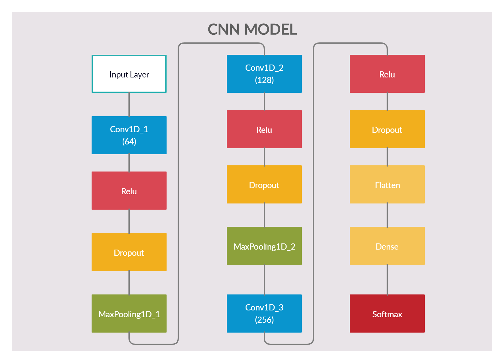
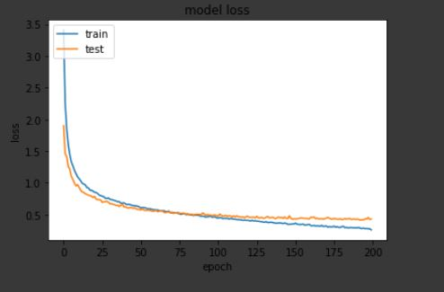
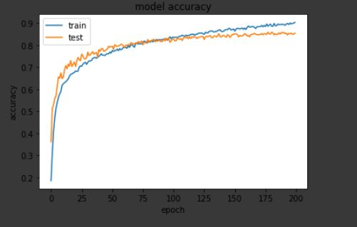
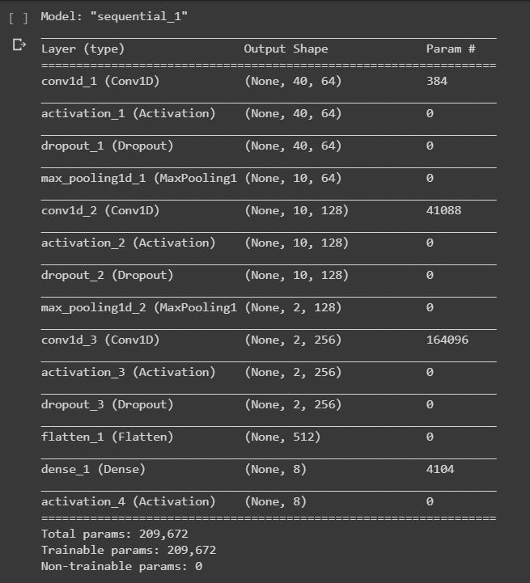
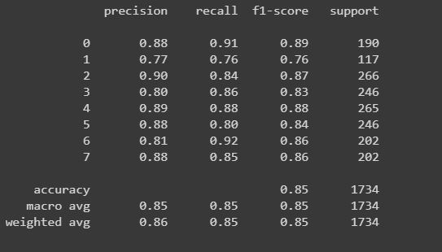

# Speech-Emotion-Detection
Emotions are important part of understanding human interactions. Research is going into finding methods that can at the very least mimic human ability to recognise emotions displayed in the form of facial expressions, changes in tone while speaking, etc. Speech Emotion Recognition (SER) is one of such fields. Using deep learning and machine learning algorithms with the help of Ravdess and TESS dataset we aim to design an automatic emotion recognition system.

**Feature set information**

For this task, the dataset is built using 5252 samples from:

- the [Ryerson Audio-Visual Database of Emotional Speech and Song (RAVDESS) dataset](https://zenodo.org/record/1188976#.XsAXemgzaUk) 
- the [Toronto emotional speech set (TESS) dataset](https://tspace.library.utoronto.ca/handle/1807/24487) 

The samples include: 

- 1440 speech files and 1012 Song files from **RAVDESS**. This dataset includes recordings of 24 professional actors (12 female, 12 male), vocalizing two lexically-matched statements in a neutral North American accent. Speech includes calm, happy, sad, angry, fearful, surprise, and disgust expressions, and song contains calm, happy, sad, angry, and fearful emotions. Each file was rated 10 times on emotional validity, intensity, and genuineness. Ratings were provided by 247 individuals who were characteristic of untrained adult research participants from North America. A further set of 72 participants provided test-retest data. High levels of emotional validity, interrater reliability, and test-retest intrarater reliability were reported. Validation data is open-access, and can be downloaded along with our paper from [PLoS ONE](https://journals.plos.org/plosone/article?id=10.1371/journal.pone.0196391).

- 2800 files from **TESS**. A set of 200 target words were spoken in the carrier phrase "Say the word _____' by two actresses (aged 26 and 64 years) and recordings were made of the set portraying each of seven emotions (anger, disgust, fear, happiness, pleasant surprise, sadness, and neutral). There are 2800 stimuli in total. Two actresses were recruited from the Toronto area. Both actresses speak English as their first language, are university educated, and have musical training. Audiometric testing indicated that both actresses have thresholds within the normal range.

**Metrics**

*Model summary*

 

*Loss and accuracy plots*

 

*Classification report*

*Confusion matrix*

